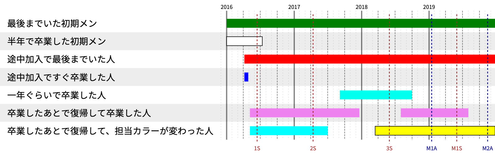

# 在籍期間タイムライン生成ツール

Wikipedia にあるアイドルグループの記事の、在籍期間画像を生成するツールです。


## 使い方

### 1. json を用意する

文字コードは UTF-8 にしてください。

json の内容はこんな感じです。

```json
{
  "width": 1600,
  "height": 400,
  "name_ratio": 0.4,
  "unit": "px",
  "end": "2019.12.24",
  "members": [
    {
      "name": "最後までいた初期メン",
      "in": "2018年1月1日",
      "color": "green"
    },
    {
      "name": "半年で卒業した初期メン",
      "in": "2018年1月1日",
      "out": "2018年7月12日",
      "color": "white",
      "border_color": "black"
    },
    {
      "name": "途中加入で最後までいた人",
      "in": "2018年4月7日",
      "color": "red"
    },
    {
      "name": "途中加入ですぐ卒業した人",
      "in": "2018年4月7日",
      "out": "2018年4月28日",
      "color": "#00f"
    },
    {
      "name": "一年ぐらいで卒業した人",
      "in": "２０１８年５月６日",
      "out": "２０１９年４月３１日",
      "color": "#eebc00"
    }
  ]
}
```

json 内の要素は下表のとおりです。

|要素|説明|省略時|
|:--|:--|:--|
|width|出力画像の横幅。ピクセル単位。|1600|
|height|出力画像の縦幅。ピクセル単位。|適当に計算する|
|end|グラフの右端の日付|画像を作った日|
|members\[*\].name|メンバ名|省略不可|
|members\[*\].in|加入年月日|省略不可|
|members\[*\].out|卒業等の年月日|グラフの右端まで伸びる|
|members\[*\].color|グラフの色|`rgb(0,0,255)`|
|members\[*\].border|グラフの枠線の色|枠線なし|

グラフの色は `red` のような web color 名、 `#ff00ff` や `#f0f` のような形式、 `rgb(0,0,255)` のような形式のいずれも OK です。
`members\[*\].border` は、メンバーカラーが白などの場合に指定してください。

年月日は、「2020年08月12日」や「2020.8.1」などの形式に対応します。年月日の順である必要があります。
いわゆる全角数字には対応します。
漢数字や英語の月名などには対応しません。

### 2. json を「ここに jsonファイルをドロップすると、在籍期間タイムライン画像を生成します。」のあたりにドロップする

上記の json ファイルをブラウザ上の「ここに jsonファイルをドロップすると、在籍期間タイムライン画像を生成します。」のあたりにドロップすると、下図のような画像が生成されます。



### 3. PNG を取得する

出来上がった画像のあたりで右クリックをし、コピーなりダウンロードなりしてください。

