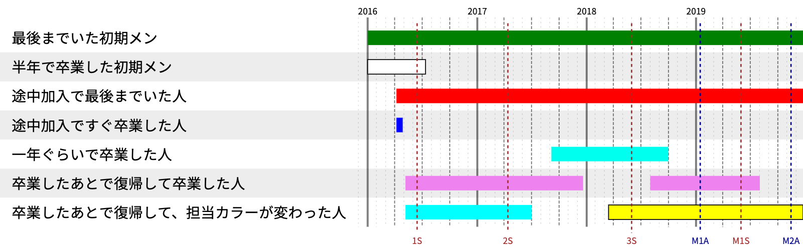

# 在籍期間タイムライン生成ツール

Wikipedia にあるアイドルグループの記事の、在籍期間画像を生成するツールです。


## 使い方

### 0. サーバにアクセスする

https://nabetani-z.github.io/affiliation-chart

で使えます。

### 1. json を用意する

文字コードは UTF-8 にしてください。

json の内容はこんな感じです。

```json
{
  "width": 1600,
  "height": 500,
  "end": "2019.12.24",
  "members": [
    {
      "name": "最後までいた初期メン",
      "in": "2016年1月1日",
      "color": "green"
    },
    {
      "name": "半年で卒業した初期メン",
      "in": "2016年1月1日",
      "out": "2016年7月12日",
      "color": "white",
      "border_color": "black"
    },
    {
      "name": "途中加入で最後までいた人",
      "in": "2016年4月7日",
      "color": "red"
    },
    {
      "name": "途中加入ですぐ卒業した人",
      "in": "2016年4月7日",
      "out": "2016年4月28日",
      "color": "#00f"
    },
    {
      "name": "一年ぐらいで卒業した人",
      "in": "２０１７年９月６日",
      "out": "２０１８年９月３１日",
      "color": "#00ffee"
    },
    {
      "name": "卒業したあとで復帰して卒業した人",
      "color": "violet",
      "enrollments": [
        {
          "in": "2016.5.6",
          "out": "2017.12.20"
        },
        {
          "in": "2018.8.1",
          "out": "2019.8.2"
        }
      ]
    },
    {
      "name": "卒業したあとで復帰して、担当カラーが変わった人",
      "enrollments": [
        {
          "in": "2016.5.6",
          "out": "2017.7.1",
          "color": "aqua"
        },
        {
          "in": "2018.3.15",
          "color": "yellow",
          "border_color": "black"
        }
      ]
    }
  ],
  "events": [
    {
      "label": "1S",
      "t": "2016.6.15",
      "color": "brown"
    },
    {
      "label": "2S",
      "t": "2017年4月14日",
      "color": "brown"
    },
    {
      "label": "3S",
      "t": "2018.6.1",
      "color": "brown"
    },
    {
      "label": "M1A",
      "t": "2019.1.15",
      "color": "darkblue"
    },
    {
      "label": "M1S",
      "t": "2019.6.1",
      "color": "brown"
    },
    {
      "label": "M2A",
      "t": "2019.11.15",
      "color": "darkblue"
    }
  ]
}
```

json 内の要素は下表のとおりです。

|要素|説明|省略時|
|:--|:--|:--|
|width|出力画像の横幅。ピクセル単位。|1600|
|height|出力画像の縦幅。ピクセル単位。|適当に計算する|
|end|グラフの右端の日付|画像を作った日|
|members|メンバ情報の配列|省略不可|
|events|イベント情報の配列|省略可|

メンバ情報は加入時期が連続であるパターンと不連続であるパターンがあります。

連続の場合は下表のとおりです。
|要素|説明|省略時|
|:--|:--|:--|
|color|グラフの色|`rgb(0,0,255)`|
|border_color|グラフの枠線の色|枠線なし|
|in|加入年月日|省略不可|
|out|卒業年月日|グラフの右端までバーが伸びる|

加入時期が不連続の場合は下表のとおりです。

|要素|説明|省略時|
|:--|:--|:--|
|color|グラフの色を省略した場合の色|`rgb(0,0,255)`|
|border_color|グラフの枠線の色を省略した場合の色|枠線なし|
|border|グラフの枠線の色|枠線なし|
|enrollments\[\*\].in|加入年月日|省略不可|
|enrollments\[\*\].out|(一旦)卒業した年月日|グラフの右端までバーが伸びる|
|enrollments\[\*\].color|その加入時期のグラフの色|member\[\*\].color|
|enrollments\[\*\].border_color|グラフの枠線の色を省略した場合の色|member\[\*\].border_color|


イベント情報は下表のとおりです。
|要素|説明|省略時|
|:--|:--|:--|
|label|イベントにつけるラベル。|省略不可|
|t|イベントの年月日|省略不可|
|color|イベントの色|black|

イベントのラベルは1〜3文字程度の短いものを使うのがおすすめです。


グラフの色は `red` のような web color 名、 `#ff00ff` や `#f0f` のような形式、 `rgb(0,0,255)` のような形式のいずれも OK です。
`border_color` は、メンバーカラーが白などの場合に指定してください。

年月日は、「2020年08月12日」や「2020.8.1」などの形式に対応します。年月日の順である必要があります。
いわゆる全角数字には対応します。
漢数字や英語の月名などには対応しません。

### 2. json を「ここに jsonファイルをドロップすると、在籍期間タイムライン画像を生成します。」のあたりにドロップする

上記の json ファイルをブラウザ上の「ここに jsonファイルをドロップすると、在籍期間タイムライン画像を生成します。」のあたりにドロップすると、下図のような画像が生成されます。



### 3. PNG を取得する

出来上がった画像のあたりで右クリックをし、コピーなりダウンロードなりしてください。

URL に JSON にある情報と今日の日付が入ります。その URL を使うと同じ画像が得られます。

